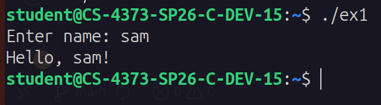
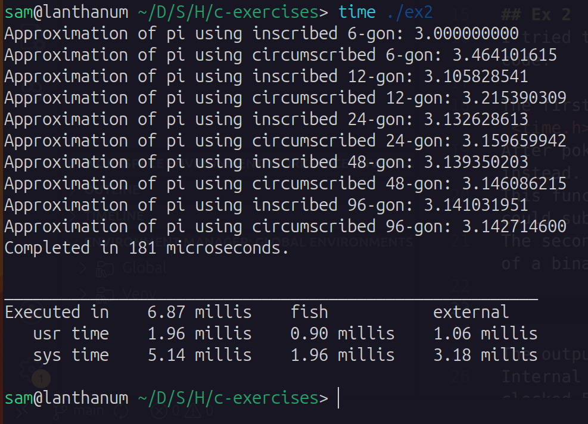

# C Exercies
### Sam Schulman

## Ex 1

I interpreted the instructions here as requiring taking in the name from stdin, so I tried to use `scanf` since it's quick and dirty and would get the job done.
I encountered a problem, though, when running it on my lab VM in an SSH session.
Something about how SSH handled/buffered newlines made it completely skip waiting for my input and immediately output with an empty name, then exit.
So I switched to using `fgets(stdin)` which worked, although I had to remove an extra newline from the end of the string with some clever array indexing.

Speaking of arrays, I did use static strings for this.

## Ex 2
I tried two different ways of timing this program: within the code and outside the code.

The first method did give me some trouble, because the ordinary c `time()` from `<time.h>` only gives you time in seconds.
After poking around online I wound up using `<sys/time.h>` and `gettimeofday` instead.
This function returns a struct which has fields for seconds and microseconds, so I could subtract a starting and ending time with adequate resolution.
The second method was with the `time` package on linux, which times the execution of a binary.

The output shows the stark contrast in the results.
Internal measurement registered only 181 microseconds and external measurement clocked 38 times that span.
I surmise this is because my internal timing does not count OS-level process initialization or teardown procedures, and that's what makes up the difference.

No issues with convergence per se, although in theory I would run up against the limits of the C `double` type, with only so much precision available.
C does have a `long double` type, but the standard library `sqrt` and `pow` functions don't use it, so I stuck with normal `double`.

## Ex 3