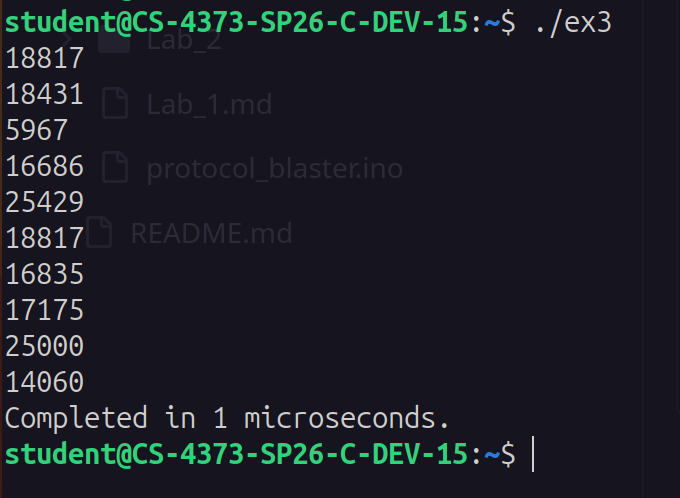
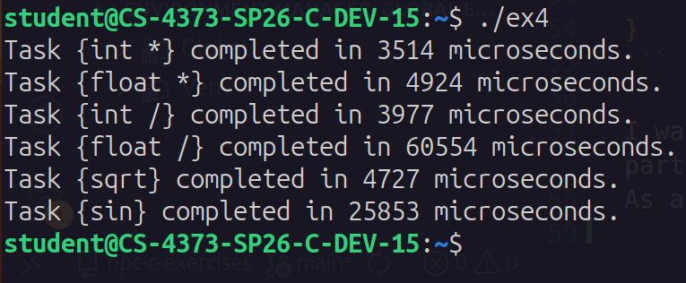
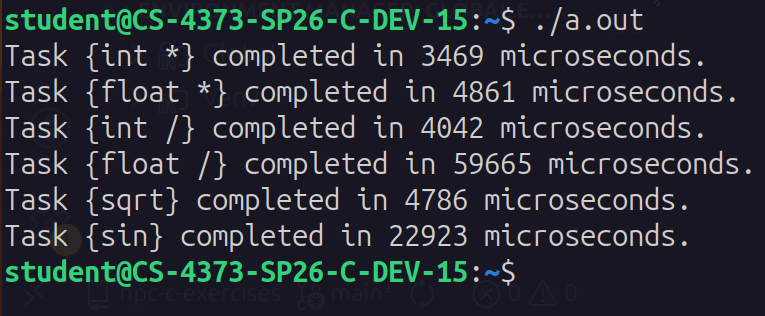

# C Exercies

### Sam Schulman

## Ex 1 - Hello world with stdin

I interpreted the instructions here as requiring taking in the name from stdin, so I tried to use `scanf` since it's quick and dirty and would get the job done.
I encountered a problem, though, when running it on my lab VM in an SSH session.
Something about how SSH handled/buffered newlines made it completely skip waiting for my input and immediately output with an empty name, then exit.
So I switched to using `fgets(stdin)` which worked, although I had to remove an extra newline from the end of the string with some clever array indexing.

Speaking of arrays, I did use static strings for this.


## Ex 2 - Archimedes algorithm

I tried two different ways of timing this program: within the code and outside the code.

The first method did give me some trouble, because the ordinary c `time()` from `<time.h>` only gives you time in seconds.
After poking around online I wound up using `<sys/time.h>` and `gettimeofday` instead.
This function returns a struct which has fields for seconds and microseconds, so I could subtract a starting and ending time with adequate resolution.
The second method was with the `time` package on linux, which times the execution of a binary.


The output shows the stark contrast in the results.
Internal measurement registered only 181 microseconds and external measurement clocked 38 times that span.
I surmise this is because my internal timing does not count OS-level process initialization or teardown procedures, and that's what makes up the difference.
Further support for this can be found by looking at the CPU time breakdown, since most of the 6.87ms was from sys time, not usr time.

No issues with convergence per se, although in theory I would run up against the limits of the C `double` type, with only so much precision available.
C does have a `long double` type, but the standard library `sqrt` and `pow` functions don't use it, so I stuck with normal `double`.

## Ex 3 - Matrix/vector multiplication

I assumed the text file needed to be loaded dynamically and couldn't just be statically programmed into the code, so I wrote a routine using `fgets` and `sscanf` to do that work.

My matrix is a dynamically-allocated buffer, storing the matrix in one-dimensional memory in row-major order.

I had to figure out how to read lines from the file with a dynamic number of numbers per line.
I landed on a strategy that involved `sscanf` to load one value at a time, advancing my string pointer to the start of the next value by using `strchr` to find the next space.
I didn't want to spend more time on my I/O than my actual multiplication routine so as a result I'm trusting that the row/column values will not lie to me.
If they did, this would end with garbage data and almost certainly a segfault.

The actual computation was surprisingly simple.
Honestly, it was very satisfying having the real computation be only five lines with the real meat of it being only one.

```c
for (int i=0; i < rows; i++){
    for (int j=0; j < cols; j++){
        out[i] += matrix[i*cols+j]*vector[j];
    }
}
```

I wanted to exclude the I/O time from the equation and time only the matrix multiplication part, since that feels like the real core of the task here.
As a result, I decided to stick with my code-internal timing strategy from exercise 2.

Provided below is a screenshot of my output:



Remarkably fast computation, though I wonder how it would scale with larger matrices.

## Ex 4 - Timing arithmetic operations

I used a similar timing strategy for this exercise as the previous two, however, since some of these operations are likely on the order of only a few processor cycles each, I figured that even with my timing resolution in the microseconds I would probably be completely unable to time them.
My fix for this is just to run them each one million times (that number is easily tunable by altering my `#define ITER`).

I decided that to really characterize these operations properly, I needed to run them with integer and floating point operands (at least for multiplication and division).
I also needed a strategy for choosing my operands, since doing a ton of meaningless calculations like this is always going to be at the mercy of smart compilers optimizing them into trivial forms or even deleting them altogether.
That introduces considerable potential confusion into this activity, and is why I tried to make my calculations not-obviously-trivial so that the compiler would be more likely to translate them more directly.
This may be overly cautious by me, but oh well.
 - **Multiplication**: I used my loop incrementor variable (with either type) and multiplied it with an accumulator variable each time, saving the result to the accumulator. This will certainly result in some overflow, but that doesn't matter because the math isn't the point, the timing is. This is the operation I'm the most worried about being deleted by a clever compiler, and I'm hoping that having the result of one loop's calculation affect the next loop will create a complex enough relationship to confound that.
 - **Division**: I selected a pseudorandom divisor between 0 and 999 at program start and divided the loop incrementor variable by that value each time. For the floating point calculation, I used some pointer and type casting tricks to interpret the same *bits* of the integer divisor as floating point, and used that value.
 - **Sqrt**: I took the square root of the loop incrementor variable each time.
 - **Sin**: I took the sine of the loop incrementor variable each time.

The results:



My iteration seems to have been necessary.
No single one of these operations would have taken more than a microsecond.

Integer multiplication, float multiplication, integer division, and square root are all in the same league.
Square root is a very surprising inclusion in that list, as I would have imagined it to be a more costly iterative process.
I'm very curious as to what's going on there, and if there is any hardware acceleration, or maybe precomputed values for low numbers which are more likely to be queried.

Next on the list is sine, which is roughly 5-6 times slower than these, and then floating point division, which is more than twice as slow as sine.
I knew floating point division was costly, but I would have expected the math library functions to beat it handily on speed.

Out of sheer curiosity, I re-compiled this code with a different compiler (clang) to see if that made a difference.
It didn't.
The timing values are barely different at all:



